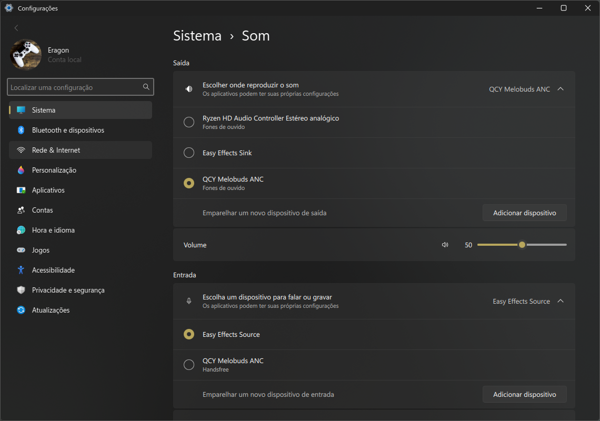
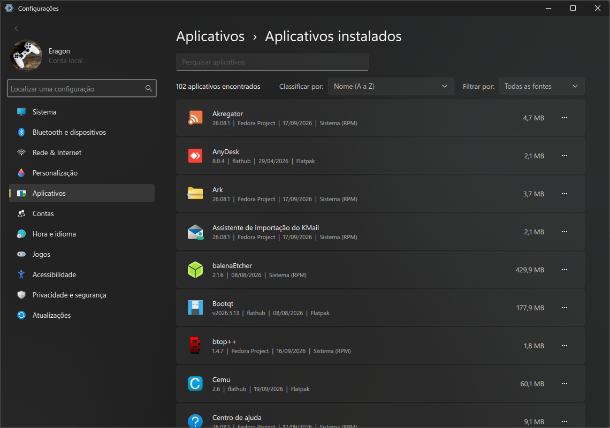
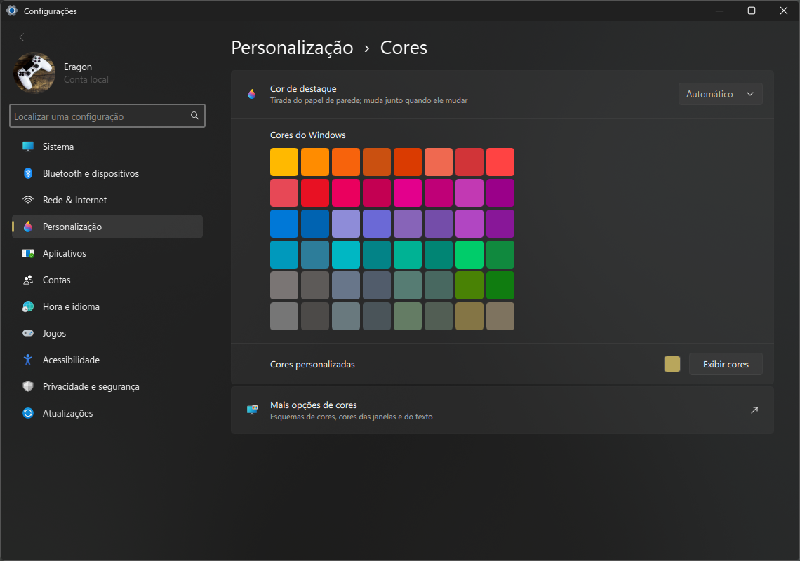
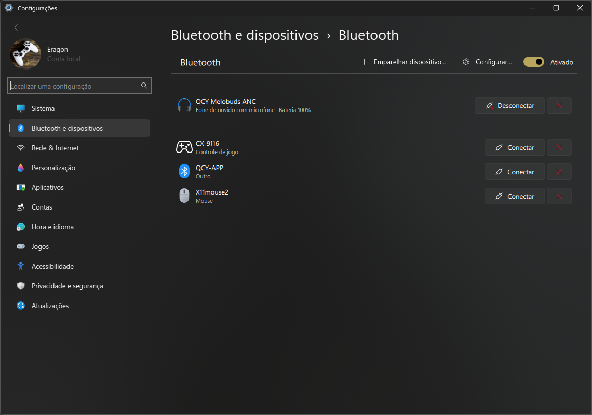

# settings-w11

As **Configurações do KDE Plasma 6** organizadas como as do **Windows 11**.

<p>
  
  
  
  
</p>

Barra lateral com a sua conta, "Localizar uma configuração" e as seções do Windows
(Sistema, Bluetooth e dispositivos, Rede & Internet, Personalização, Aplicativos, Contas,
Hora e idioma, Jogos, Acessibilidade, Privacidade e segurança, Atualizações). Cada seção
tem cartões com ícone, título e descrição; a página Sistema mostra o papel de parede, o nome
do computador (com "Renomear") e o modelo.

Ao abrir um cartão, o módulo do KDE correspondente aparece dentro do app, com a trilha do
Windows ("Sistema › Som") e os botões Padrões / Redefinir / Aplicar quando o módulo usa.
Módulos que não existem no sistema não aparecem.

Algumas páginas são refeitas do zero com o visual do Windows (em `pages/`, QML):

- **Som** — "Escolher onde reproduzir o som" e o dispositivo de entrada em cartões que
  expandem, volume, mixer por aplicativo e "Mais configurações de som" (o módulo do KDE
  completo, com perfis e portas). Usa o plasma-pa.
- **Cores** — cor de destaque Manual ou Automática (tirada do papel de parede), as 48
  cores do Windows e cores personalizadas.
- **Aplicativos instalados** — todos os apps do menu com versão, publicador, data e
  tamanho; pesquisa, ordenação e filtro por origem. O "⋯" desinstala direto, sem loja:
  pacotes do sistema (o dnf simula antes e mostra o que sai junto; o que derrubaria a
  sessão é bloqueado), Flatpak, Snap, e AppImages/atalhos soltos vão para a lixeira.

## Instalar

```sh
git clone https://github.com/jesieldotdev/settings-w11
cd settings-w11
./build.sh
```

Instala em `~/.local` e faz o comando `systemsettings` (menu Iniciar, bandeja, "Configurar…"
dos aplicativos) abrir o settings-w11 — inclusive pedindo um módulo, como
`systemsettings kcm_pulseaudio`. Saia e entre de novo na sessão para valer também no painel.

Para remover: `./uninstall.sh`.

## Organização

| Seção | Itens |
|---|---|
| Sistema | Vídeo, Som, Notificações, Ligar/Desligar, Multitarefas, Área de Trabalho Remota, Sobre |
| Bluetooth e dispositivos | Bluetooth, Impressoras, Mouse, Touchpad, Caneta, Tela touch, Reprodução Automática |
| Rede & Internet | Wi-Fi e Ethernet, Celular, Proxy |
| Personalização | Plano de fundo, Cores, Temas, Tela de bloqueio, Fontes, Barra de tarefas |
| Aplicativos | Instalados, Padrão, Inicialização, Permissões, Atalhos da web |
| Contas | Suas informações, Contas online, Senhas salvas, Tela de entrada |
| Hora e idioma | Data e hora, Idioma e região, Digitação |
| Jogos | Controles de jogo |
| Acessibilidade | Acessibilidade, Efeitos visuais, Teclado virtual |
| Privacidade e segurança | Pesquisa de arquivos, Pesquisa, Histórico, Permissões, Diagnóstico |
| Atualizações | Atualizações, Procurar atualizações |

O catálogo fica em `src/catalog.h`.

Faz parte do visual completo do [plasma-w11](https://github.com/jesieldotdev/plasma-w11).

## Licença

GPL-2.0-or-later.
